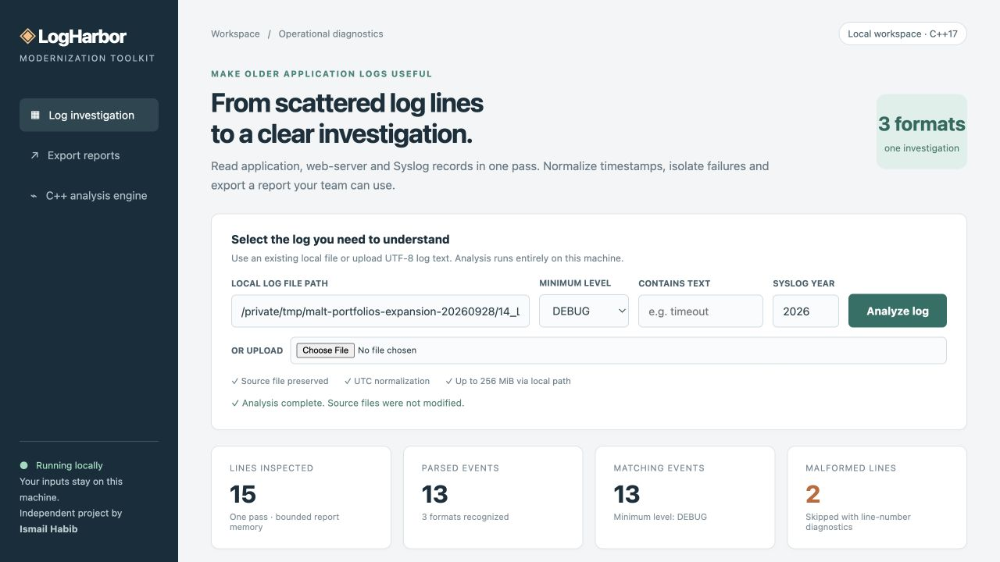
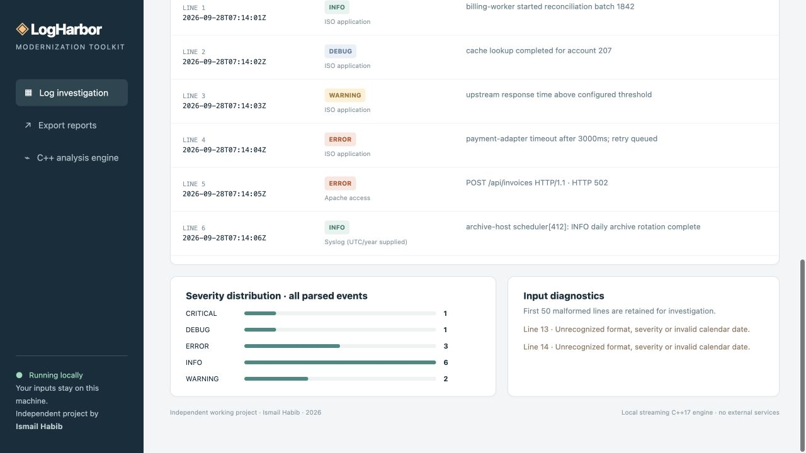

# LogHarbor — Legacy Log Investigation & UTC Reporting

A working streaming C++17 log engine with a local investigation workspace that reads real files, normalizes supported timestamps to UTC, filters events and exports clear reports.

## What it does

- Streaming parsing of ISO application, Apache access and classic Syslog text
- UTC normalization, explicit Syslog year and severity mapping
- Case-insensitive message filtering with bounded matching-event output
- Malformed-line diagnostics plus downloadable JSON, CSV and HTML reports

## Screenshots

Actual running application, captured with labelled synthetic test data.



The running log workspace accepts local files or uploads with severity, text and Syslog-year controls.



Real parsing output from the labeled synthetic mixed-format fixture, including normalized timestamps and diagnostic totals.

## Quick start — macOS / POSIX

Requirements: Python 3.10+ and a C++17 compiler (Apple Command Line Tools provides clang++). No Python packages, API keys or external services are required.

1. Open this project folder.
2. Double-click `Start.command`, or run `./run.sh` in a terminal.
3. Open http://127.0.0.1:8114 in your browser.
4. Replace the fixture path with your own UTF-8 log file and click **Analyze log**.
5. Download CSV, JSON or HTML from the resulting report.
6. Stop the terminal process with Control-C when finished.

The start script compiles the C++ engine from source when needed. Build outputs are local and are excluded from this repository.

## Command-line use

```sh
mkdir -p runtime
c++ -std=c++17 -O2 -Wall -Wextra -Wpedantic src/logharbor.cpp -o runtime/logharbor
./runtime/logharbor "fixtures/service-mixed.log" ERROR timeout 2026
```

The executable prints structured JSON to standard output; invalid input produces an error on standard error and a nonzero exit code.

## Verify

Build the engine with the command above before running the checks.

```sh
python3 -m unittest discover -s tests -v
# With the local server running:
python3 tests/http_checks.py
```

## Windows build path — unverified

CMakeLists.txt targets C++17 and includes MSVC /utf-8 and /W4 options. In a Visual Studio developer terminal, build using `cmake -S . -B build` followed by `cmake --build build --config Release`. Copy the resulting `logharbor.exe` into `runtime` and adjust the server engine filename for Windows, then start with `python server.py`. The C++ Windows entry point uses wide arguments before UTF-8 conversion. This configuration is supplied for further validation; it has not been compiled or run on Windows.

## Scope and limits

Independent new modernization-support tool; no historical client migration is claimed. Windows execution and MSVC compilation are not verified. UTF-8 input and three documented formats only. Zone-free timestamps assume UTC; Syslog year is supplied. No multiline stack-trace reconstruction or live tailing. Reports retain the first 500 matches.

Limits: 256 MiB local file, 8 MiB upload, 1,000,000 inspected lines, 64 KiB per line, 500 retained matching events, 50 retained malformed-line diagnostics. Counts cover all inspected lines; CSV and HTML event tables are bounded. Fractional seconds are accepted but normalized at whole-second precision. Supported date years are 1970–2099. Blank and unsupported records count as malformed. No aggregation service, live ingestion or remote collection is included.

## Data handling

The server accepts only local browser requests and never sends input to external services. It accepts real local paths that the current user can read. Use this as a single-user local tool, not a public internet server. Last reports and uploaded logs are stored in `runtime`; deleting those generated files removes those local copies. The original inputs are never intentionally changed. Fixture data is synthetic and labeled.

## Project documentation

- [Recorded verification](TEST_RESULTS.md)
- [Screenshot captions](screenshots/CAPTIONS.md)

## License

[MIT](LICENSE) © 2026 Ismail Habib.
